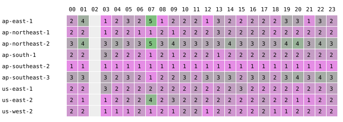
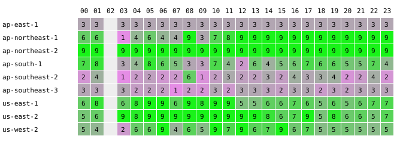

# Spot placement score log

Generated 2026-08-28 22:13 UTC. Scores are 1–10; a region counts as available at ≥ 5. The single-type set is scored low by design (EC2 wants three or more instance types); read it relative to itself over time and use the trio set as the calibrated reference.

## g5.xlarge (g5.xlarge)

| region | samples | hours ≥ 5 | mean score | latest |
|---|---|---|---|---|
| ap-east-1 | 7 | 0% | 1.0 | 1 (08-28 22:13Z) |
| ap-northeast-1 | 7 | 0% | 1.6 | 3 (08-28 22:13Z) |
| ap-northeast-2 | 7 | 0% | 3.0 | 3 (08-28 22:13Z) |
| ap-south-1 | 7 | 0% | 2.4 | 3 (08-28 22:13Z) |
| ap-southeast-2 | 7 | 0% | 1.0 | 1 (08-28 22:13Z) |
| ap-southeast-3 | 7 | 0% | 3.0 | 3 (08-28 22:13Z) |
| us-east-1 | 7 | 0% | 2.4 | 1 (08-28 22:13Z) |
| us-east-2 | 7 | 0% | 1.3 | 1 (08-28 22:13Z) |
| us-west-2 | 7 | 0% | 1.7 | 1 (08-28 22:13Z) |

### Last 48 samples

```
region           oldest → newest (48 h, one char per sample)
ap-east-1                                                 1111111
ap-northeast-1                                            1113113
ap-northeast-2                                            3333333
ap-south-1                                                3331313
ap-southeast-2                                            1111111
ap-southeast-3                                            3333333
us-east-1                                                 3233321
us-east-2                                                 1111131
us-west-2                                                 2212221
```

### Mean score by UTC hour

| region | 00 | 01 | 02 | 03 | 04 | 05 | 06 | 07 | 08 | 09 | 10 | 11 | 12 | 13 | 14 | 15 | 16 | 17 | 18 | 19 | 20 | 21 | 22 | 23 |
|---|---|---|---|---|---|---|---|---|---|---|---|---|---|---|---|---|---|---|---|---|---|---|---|---|
| ap-east-1 | · | · | · | 1 | · | · | · | · | · | · | · | 1 | · | · | 1 | · | · | · | · | · | · | 1 | 1 | 1 |
| ap-northeast-1 | · | · | · | 1 | · | · | · | · | · | · | · | 1 | · | · | 3 | · | · | · | · | · | · | 1 | 2 | 1 |
| ap-northeast-2 | · | · | · | 3 | · | · | · | · | · | · | · | 3 | · | · | 3 | · | · | · | · | · | · | 3 | 3 | 3 |
| ap-south-1 | · | · | · | 3 | · | · | · | · | · | · | · | 1 | · | · | 1 | · | · | · | · | · | · | 3 | 3 | 3 |
| ap-southeast-2 | · | · | · | 1 | · | · | · | · | · | · | · | 1 | · | · | 1 | · | · | · | · | · | · | 1 | 1 | 1 |
| ap-southeast-3 | · | · | · | 3 | · | · | · | · | · | · | · | 3 | · | · | 3 | · | · | · | · | · | · | 3 | 3 | 3 |
| us-east-1 | · | · | · | 3 | · | · | · | · | · | · | · | 2 | · | · | 3 | · | · | · | · | · | · | 3 | 2 | 3 |
| us-east-2 | · | · | · | 1 | · | · | · | · | · | · | · | 3 | · | · | 1 | · | · | · | · | · | · | 1 | 1 | 1 |
| us-west-2 | · | · | · | 1 | · | · | · | · | · | · | · | 2 | · | · | 2 | · | · | · | · | · | · | 2 | 2 | 2 |



### Best single AZ per sample

| region | samples | hours ≥ 5 | mean score | latest |
|---|---|---|---|---|
| ap-east-1 ape1-az1 | 4 | 0% | 1.0 | 1 (08-28 22:13Z) |
| ap-northeast-1 apne1-az1 | 1 | 0% | 1.0 | 1 (08-26 22:23Z) |
| ap-northeast-1 apne1-az4 | 3 | 0% | 2.3 | 3 (08-28 22:13Z) |
| ap-northeast-2 apne2-az1 | 7 | 0% | 3.0 | 3 (08-28 22:13Z) |
| ap-northeast-2 apne2-az3 | 7 | 0% | 3.0 | 3 (08-28 22:13Z) |
| ap-northeast-2 apne2-az4 | 7 | 0% | 3.0 | 3 (08-28 22:13Z) |
| ap-south-1 aps1-az1 | 5 | 0% | 2.2 | 3 (08-28 22:13Z) |
| ap-south-1 aps1-az3 | 5 | 0% | 3.0 | 3 (08-28 22:13Z) |
| ap-southeast-3 apse3-az1 | 4 | 0% | 1.0 | 1 (08-28 22:13Z) |
| ap-southeast-3 apse3-az3 | 7 | 0% | 3.0 | 3 (08-28 22:13Z) |
| us-east-1 use1-az1 | 1 | 0% | 1.0 | 1 (08-26 22:23Z) |
| us-east-1 use1-az2 | 4 | 0% | 1.0 | 1 (08-28 22:13Z) |
| us-east-1 use1-az4 | 1 | 0% | 1.0 | 1 (08-26 22:23Z) |
| us-east-1 use1-az6 | 4 | 0% | 1.0 | 1 (08-28 11:16Z) |
| us-east-2 use2-az1 | 2 | 0% | 1.0 | 1 (08-28 11:16Z) |
| us-east-2 use2-az2 | 2 | 0% | 1.0 | 1 (08-27 14:06Z) |
| us-east-2 use2-az3 | 1 | 0% | 2.0 | 2 (08-28 11:16Z) |
| us-west-2 usw2-az2 | 1 | 0% | 1.0 | 1 (08-26 22:23Z) |
| us-west-2 usw2-az3 | 4 | 0% | 1.0 | 1 (08-28 11:16Z) |

## g-xlarge-trio (g5.xlarge, g4dn.xlarge, g6.xlarge)

| region | samples | hours ≥ 5 | mean score | latest |
|---|---|---|---|---|
| ap-east-1 | 7 | 0% | 3.0 | 3 (08-28 22:13Z) |
| ap-northeast-1 | 7 | 86% | 7.9 | 9 (08-28 22:13Z) |
| ap-northeast-2 | 7 | 100% | 9.0 | 9 (08-28 22:13Z) |
| ap-south-1 | 7 | 0% | 2.7 | 3 (08-28 22:13Z) |
| ap-southeast-2 | 7 | 14% | 2.1 | 9 (08-28 22:13Z) |
| ap-southeast-3 | 7 | 0% | 3.0 | 3 (08-28 22:13Z) |
| us-east-1 | 7 | 100% | 6.6 | 5 (08-28 22:13Z) |
| us-east-2 | 7 | 57% | 5.9 | 2 (08-28 22:13Z) |
| us-west-2 | 7 | 14% | 4.0 | 2 (08-28 22:13Z) |

### Last 48 samples

```
region           oldest → newest (48 h, one char per sample)
ap-east-1                                                 3333333
ap-northeast-1                                            9919999
ap-northeast-2                                            9999999
ap-south-1                                                3331333
ap-southeast-2                                            1111119
ap-southeast-3                                            3333333
us-east-1                                                 7667875
us-east-2                                                 9299192
us-west-2                                                 4424392
```

### Mean score by UTC hour

| region | 00 | 01 | 02 | 03 | 04 | 05 | 06 | 07 | 08 | 09 | 10 | 11 | 12 | 13 | 14 | 15 | 16 | 17 | 18 | 19 | 20 | 21 | 22 | 23 |
|---|---|---|---|---|---|---|---|---|---|---|---|---|---|---|---|---|---|---|---|---|---|---|---|---|
| ap-east-1 | · | · | · | 3 | · | · | · | · | · | · | · | 3 | · | · | 3 | · | · | · | · | · | · | 3 | 3 | 3 |
| ap-northeast-1 | · | · | · | 1 | · | · | · | · | · | · | · | 9 | · | · | 9 | · | · | · | · | · | · | 9 | 9 | 9 |
| ap-northeast-2 | · | · | · | 9 | · | · | · | · | · | · | · | 9 | · | · | 9 | · | · | · | · | · | · | 9 | 9 | 9 |
| ap-south-1 | · | · | · | 3 | · | · | · | · | · | · | · | 3 | · | · | 1 | · | · | · | · | · | · | 3 | 3 | 3 |
| ap-southeast-2 | · | · | · | 1 | · | · | · | · | · | · | · | 1 | · | · | 1 | · | · | · | · | · | · | 1 | 5 | 1 |
| ap-southeast-3 | · | · | · | 3 | · | · | · | · | · | · | · | 3 | · | · | 3 | · | · | · | · | · | · | 3 | 3 | 3 |
| us-east-1 | · | · | · | 6 | · | · | · | · | · | · | · | 7 | · | · | 7 | · | · | · | · | · | · | 7 | 6 | 8 |
| us-east-2 | · | · | · | 9 | · | · | · | · | · | · | · | 9 | · | · | 9 | · | · | · | · | · | · | 9 | 2 | 1 |
| us-west-2 | · | · | · | 2 | · | · | · | · | · | · | · | 9 | · | · | 4 | · | · | · | · | · | · | 4 | 3 | 3 |



### Best single AZ per sample

| region | samples | hours ≥ 5 | mean score | latest |
|---|---|---|---|---|
| ap-east-1 ape1-az1 | 4 | 0% | 3.0 | 3 (08-28 22:13Z) |
| ap-east-1 ape1-az2 | 4 | 0% | 3.0 | 3 (08-28 11:16Z) |
| ap-east-1 ape1-az3 | 6 | 0% | 3.0 | 3 (08-28 11:16Z) |
| ap-northeast-1 apne1-az1 | 5 | 80% | 7.8 | 3 (08-28 22:13Z) |
| ap-northeast-1 apne1-az2 | 5 | 0% | 3.0 | 3 (08-28 22:13Z) |
| ap-northeast-1 apne1-az4 | 5 | 100% | 9.0 | 9 (08-28 22:13Z) |
| ap-northeast-2 apne2-az1 | 7 | 100% | 9.0 | 9 (08-28 22:13Z) |
| ap-northeast-2 apne2-az3 | 7 | 100% | 9.0 | 9 (08-28 22:13Z) |
| ap-northeast-2 apne2-az4 | 3 | 0% | 3.0 | 3 (08-28 11:16Z) |
| ap-south-1 aps1-az1 | 2 | 0% | 3.0 | 3 (08-28 22:13Z) |
| ap-south-1 aps1-az2 | 5 | 0% | 3.0 | 3 (08-28 22:13Z) |
| ap-south-1 aps1-az3 | 3 | 0% | 3.0 | 3 (08-28 22:13Z) |
| ap-southeast-2 apse2-az1 | 1 | 100% | 9.0 | 9 (08-28 22:13Z) |
| ap-southeast-3 apse3-az3 | 6 | 0% | 3.0 | 3 (08-28 11:16Z) |
| us-east-2 use2-az1 | 1 | 100% | 9.0 | 9 (08-27 03:05Z) |
| us-east-2 use2-az2 | 2 | 100% | 9.0 | 9 (08-27 14:06Z) |
| us-east-2 use2-az3 | 3 | 100% | 7.7 | 5 (08-28 11:16Z) |
| us-west-2 usw2-az1 | 1 | 0% | 3.0 | 3 (08-28 11:16Z) |

## Latest spot prices

| region | az | product | $/h | sampled |
|---|---|---|---|---|
| ap-northeast-1 | ap-northeast-1a | Linux/UNIX | 0.798300 | 2026-08-28T22:13:49Z |
| ap-northeast-1 | ap-northeast-1a | Windows | 0.329900 | 2026-08-28T22:13:49Z |
| ap-northeast-1 | ap-northeast-1c | Linux/UNIX | 0.841700 | 2026-08-28T22:13:49Z |
| ap-northeast-1 | ap-northeast-1c | Windows | 0.329900 | 2026-08-28T22:13:49Z |
| ap-northeast-2 | ap-northeast-2a | Linux/UNIX | 0.409800 | 2026-08-28T22:13:49Z |
| ap-northeast-2 | ap-northeast-2a | Windows | 0.307700 | 2026-08-28T22:13:49Z |
| ap-northeast-2 | ap-northeast-2c | Linux/UNIX | 0.382900 | 2026-08-28T22:13:49Z |
| ap-northeast-2 | ap-northeast-2c | Windows | 0.307700 | 2026-08-28T22:13:49Z |
| ap-northeast-2 | ap-northeast-2d | Linux/UNIX | 0.344200 | 2026-08-28T22:13:49Z |
| ap-northeast-2 | ap-northeast-2d | Windows | 0.307700 | 2026-08-28T22:13:49Z |
| ap-south-1 | ap-south-1a | Linux/UNIX | 0.505000 | 2026-08-28T22:13:49Z |
| ap-south-1 | ap-south-1a | Windows | 0.304800 | 2026-08-28T22:13:49Z |
| ap-south-1 | ap-south-1b | Linux/UNIX | 0.470100 | 2026-08-28T22:13:49Z |
| ap-south-1 | ap-south-1b | Windows | 0.304800 | 2026-08-28T22:13:49Z |
| ap-southeast-2 | ap-southeast-2a | Linux/UNIX | 0.727200 | 2026-08-28T22:13:49Z |
| ap-southeast-2 | ap-southeast-2a | Windows | 0.437300 | 2026-08-28T22:13:49Z |
| ap-southeast-2 | ap-southeast-2c | Linux/UNIX | 0.817900 | 2026-08-28T22:13:49Z |
| ap-southeast-2 | ap-southeast-2c | Windows | 0.377400 | 2026-08-28T22:13:49Z |
| us-east-1 | us-east-1a | Linux/UNIX | 0.955600 | 2026-08-28T22:13:49Z |
| us-east-1 | us-east-1a | Windows | 0.350500 | 2026-08-28T22:13:49Z |
| us-east-1 | us-east-1b | Linux/UNIX | 0.745700 | 2026-08-28T22:13:49Z |
| us-east-1 | us-east-1b | Windows | 0.329300 | 2026-08-28T22:13:49Z |
| us-east-1 | us-east-1c | Linux/UNIX | 0.637500 | 2026-08-28T22:13:49Z |
| us-east-1 | us-east-1c | Windows | 0.325900 | 2026-08-28T22:13:49Z |
| us-east-1 | us-east-1d | Linux/UNIX | 0.546300 | 2026-08-28T22:13:49Z |
| us-east-1 | us-east-1d | Windows | 0.328200 | 2026-08-28T22:13:49Z |
| us-east-1 | us-east-1f | Linux/UNIX | 0.538500 | 2026-08-28T22:13:49Z |
| us-east-1 | us-east-1f | Windows | 0.324700 | 2026-08-28T22:13:49Z |
| us-east-2 | us-east-2a | Linux/UNIX | 0.375500 | 2026-08-28T22:13:49Z |
| us-east-2 | us-east-2a | Windows | 0.284600 | 2026-08-28T22:13:49Z |
| us-east-2 | us-east-2b | Linux/UNIX | 0.358400 | 2026-08-28T22:13:49Z |
| us-east-2 | us-east-2b | Windows | 0.284600 | 2026-08-28T22:13:49Z |
| us-east-2 | us-east-2c | Linux/UNIX | 0.342700 | 2026-08-28T22:13:49Z |
| us-east-2 | us-east-2c | Windows | 0.284600 | 2026-08-28T22:13:49Z |
| us-west-2 | us-west-2a | Linux/UNIX | 0.521700 | 2026-08-28T22:13:49Z |
| us-west-2 | us-west-2a | Windows | 0.284600 | 2026-08-28T22:13:49Z |
| us-west-2 | us-west-2b | Linux/UNIX | 0.499800 | 2026-08-28T22:13:49Z |
| us-west-2 | us-west-2b | Windows | 0.284600 | 2026-08-28T22:13:49Z |
| us-west-2 | us-west-2c | Linux/UNIX | 0.495600 | 2026-08-28T22:13:49Z |
| us-west-2 | us-west-2c | Windows | 0.330500 | 2026-08-28T22:13:49Z |
