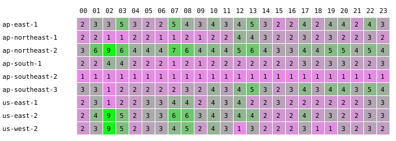
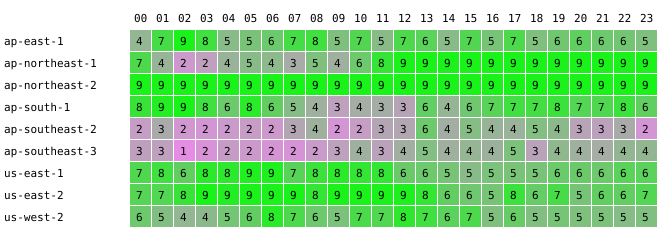

# Spot placement score log

Generated 2026-09-28 06:51 UTC. Scores are 1–10; a region counts as available at ≥ 5. The single-type set is scored low by design (EC2 wants three or more instance types); read it relative to itself over time and use the trio set as the calibrated reference.

## g5.xlarge (g5.xlarge)

| region | samples | hours ≥ 5 | mean score | latest |
|---|---|---|---|---|
| ap-east-1 | 187 | 13% | 2.9 | 1 (09-28 06:50Z) |
| ap-northeast-1 | 187 | 3% | 2.1 | 1 (09-28 06:50Z) |
| ap-northeast-2 | 187 | 18% | 4.1 | 9 (09-28 06:50Z) |
| ap-south-1 | 187 | 3% | 2.1 | 1 (09-28 06:50Z) |
| ap-southeast-2 | 187 | 0% | 1.0 | 1 (09-28 06:50Z) |
| ap-southeast-3 | 187 | 13% | 3.2 | 1 (09-28 06:50Z) |
| us-east-1 | 187 | 4% | 2.3 | 9 (09-28 06:50Z) |
| us-east-2 | 187 | 14% | 2.8 | 9 (09-28 06:50Z) |
| us-west-2 | 187 | 9% | 2.3 | 9 (09-28 06:50Z) |

### Last 48 samples

```
region           oldest → newest (48 h, one char per sample)
ap-east-1        333333333333339999999991191999199999988991139911
ap-northeast-1   112122133222233222222113432215553166444421111111
ap-northeast-2   333333333333339999999999999999999999999999999999
ap-south-1       211111111111111111111211113114111159992791344111
ap-southeast-2   111311111111111111111111111111111111111111111111
ap-southeast-3   313331333333339968999519891589999286999891111111
us-east-1        333132122323222212321131223322392332222999911999
us-east-2        133111121131131929112199289999999999999999999999
us-west-2        333121122221322211222211121995192991299999999999
```

### Mean score by UTC hour

| region | 00 | 01 | 02 | 03 | 04 | 05 | 06 | 07 | 08 | 09 | 10 | 11 | 12 | 13 | 14 | 15 | 16 | 17 | 18 | 19 | 20 | 21 | 22 | 23 |
|---|---|---|---|---|---|---|---|---|---|---|---|---|---|---|---|---|---|---|---|---|---|---|---|---|
| ap-east-1 | 2 | 3 | 3 | 5 | 3 | 2 | 2 | 6 | 4 | 2 | 2 | 2 | 1 | 4 | 2 | 2 | 2 | 4 | 2 | 4 | 4 | 2 | 4 | 3 |
| ap-northeast-1 | 2 | 2 | 1 | 1 | 2 | 2 | 1 | 2 | 2 | 1 | 2 | 2 | 2 | 3 | 2 | 2 | 2 | 3 | 2 | 3 | 2 | 2 | 3 | 2 |
| ap-northeast-2 | 3 | 6 | 9 | 6 | 4 | 4 | 4 | 6 | 5 | 4 | 3 | 3 | 3 | 5 | 4 | 3 | 3 | 4 | 4 | 5 | 5 | 4 | 5 | 4 |
| ap-south-1 | 2 | 2 | 4 | 4 | 2 | 2 | 2 | 1 | 2 | 1 | 2 | 2 | 2 | 2 | 2 | 2 | 2 | 3 | 2 | 3 | 3 | 2 | 2 | 3 |
| ap-southeast-2 | 1 | 1 | 1 | 1 | 1 | 1 | 1 | 1 | 1 | 1 | 1 | 1 | 1 | 1 | 1 | 1 | 1 | 1 | 1 | 1 | 1 | 1 | 1 | 1 |
| ap-southeast-3 | 3 | 3 | 1 | 2 | 2 | 2 | 2 | 2 | 2 | 2 | 3 | 2 | 3 | 5 | 3 | 2 | 3 | 4 | 3 | 4 | 4 | 3 | 5 | 4 |
| us-east-1 | 2 | 3 | 1 | 2 | 2 | 3 | 3 | 2 | 2 | 2 | 2 | 2 | 2 | 2 | 2 | 3 | 2 | 2 | 2 | 2 | 2 | 2 | 3 | 3 |
| us-east-2 | 2 | 4 | 9 | 5 | 2 | 3 | 3 | 6 | 4 | 3 | 2 | 2 | 2 | 5 | 2 | 2 | 2 | 4 | 2 | 3 | 2 | 2 | 3 | 3 |
| us-west-2 | 2 | 3 | 9 | 5 | 2 | 3 | 3 | 3 | 4 | 1 | 2 | 2 | 1 | 4 | 2 | 2 | 2 | 3 | 1 | 1 | 3 | 2 | 3 | 2 |



### Best single AZ per sample

| region | samples | hours ≥ 5 | mean score | latest |
|---|---|---|---|---|
| ap-east-1 ape1-az1 | 55 | 0% | 1.4 | 3 (09-27 01:21Z) |
| ap-east-1 ape1-az2 | 121 | 21% | 3.8 | 9 (09-28 04:30Z) |
| ap-northeast-1 apne1-az1 | 23 | 0% | 1.3 | 2 (09-26 19:48Z) |
| ap-northeast-1 apne1-az4 | 80 | 0% | 2.1 | 3 (09-27 18:17Z) |
| ap-northeast-2 apne2-az1 | 165 | 17% | 4.0 | 8 (09-28 03:32Z) |
| ap-northeast-2 apne2-az3 | 169 | 20% | 4.1 | 9 (09-28 06:50Z) |
| ap-northeast-2 apne2-az4 | 184 | 18% | 4.1 | 9 (09-28 06:50Z) |
| ap-south-1 aps1-az1 | 60 | 2% | 1.8 | 7 (09-27 19:17Z) |
| ap-south-1 aps1-az3 | 87 | 3% | 2.7 | 1 (09-28 02:38Z) |
| ap-southeast-2 apse2-az1 | 27 | 0% | 1.1 | 1 (09-25 22:14Z) |
| ap-southeast-2 apse2-az2 | 19 | 0% | 1.0 | 1 (09-23 00:22Z) |
| ap-southeast-3 apse3-az1 | 38 | 0% | 1.0 | 1 (09-25 01:25Z) |
| ap-southeast-3 apse3-az3 | 140 | 16% | 3.8 | 9 (09-27 23:19Z) |
| us-east-1 use1-az1 | 19 | 0% | 1.3 | 1 (09-23 05:52Z) |
| us-east-1 use1-az2 | 59 | 3% | 1.6 | 9 (09-28 04:30Z) |
| us-east-1 use1-az4 | 45 | 18% | 3.0 | 9 (09-28 06:50Z) |
| us-east-1 use1-az5 | 56 | 11% | 2.3 | 9 (09-28 06:50Z) |
| us-east-1 use1-az6 | 52 | 8% | 2.0 | 9 (09-28 06:50Z) |
| us-east-2 use2-az1 | 66 | 21% | 3.2 | 9 (09-28 04:30Z) |
| us-east-2 use2-az2 | 92 | 24% | 3.6 | 9 (09-28 06:50Z) |
| us-east-2 use2-az3 | 111 | 23% | 3.7 | 9 (09-28 06:50Z) |
| us-west-2 usw2-az1 | 67 | 25% | 3.7 | 9 (09-28 06:50Z) |
| us-west-2 usw2-az2 | 41 | 27% | 3.8 | 9 (09-28 06:50Z) |
| us-west-2 usw2-az3 | 94 | 15% | 2.8 | 9 (09-28 06:50Z) |

## g-xlarge-trio (g5.xlarge, g4dn.xlarge, g6.xlarge)

| region | samples | hours ≥ 5 | mean score | latest |
|---|---|---|---|---|
| ap-east-1 | 187 | 18% | 4.1 | 9 (09-28 06:50Z) |
| ap-northeast-1 | 187 | 78% | 7.4 | 1 (09-28 06:50Z) |
| ap-northeast-2 | 187 | 100% | 9.0 | 9 (09-28 06:50Z) |
| ap-south-1 | 187 | 55% | 6.1 | 9 (09-28 06:50Z) |
| ap-southeast-2 | 187 | 16% | 3.2 | 2 (09-28 06:50Z) |
| ap-southeast-3 | 187 | 13% | 3.2 | 1 (09-28 06:50Z) |
| us-east-1 | 187 | 78% | 7.1 | 9 (09-28 06:50Z) |
| us-east-2 | 187 | 79% | 7.5 | 9 (09-28 06:50Z) |
| us-west-2 | 187 | 59% | 6.1 | 9 (09-28 06:50Z) |

### Last 48 samples

```
region           oldest → newest (48 h, one char per sample)
ap-east-1        333333333333339999999999999999999999999999999999
ap-northeast-1   999999999999999934999219999999999999999991111111
ap-northeast-2   999999999999999999999999999999999999999999999999
ap-south-1       991999249998399992899989999999999999999999999999
ap-southeast-2   223312222222335122992229999999999999999222222222
ap-southeast-3   313331333333339968999519891589999286999891111111
us-east-1        999499944599966699545983479999999999999999999999
us-east-2        999339959999994999234899999999999999999999999999
us-west-2        999431954549955595544599343999999999999999999999
```

### Mean score by UTC hour

| region | 00 | 01 | 02 | 03 | 04 | 05 | 06 | 07 | 08 | 09 | 10 | 11 | 12 | 13 | 14 | 15 | 16 | 17 | 18 | 19 | 20 | 21 | 22 | 23 |
|---|---|---|---|---|---|---|---|---|---|---|---|---|---|---|---|---|---|---|---|---|---|---|---|---|
| ap-east-1 | 3 | 6 | 9 | 6 | 4 | 4 | 4 | 6 | 5 | 4 | 3 | 3 | 3 | 5 | 4 | 3 | 3 | 4 | 4 | 5 | 5 | 4 | 5 | 4 |
| ap-northeast-1 | 6 | 5 | 1 | 1 | 4 | 6 | 4 | 4 | 9 | 4 | 7 | 8 | 9 | 9 | 9 | 9 | 9 | 9 | 9 | 9 | 9 | 9 | 9 | 9 |
| ap-northeast-2 | 9 | 9 | 9 | 9 | 9 | 9 | 9 | 9 | 9 | 9 | 9 | 9 | 9 | 9 | 9 | 9 | 9 | 9 | 9 | 9 | 9 | 9 | 9 | 9 |
| ap-south-1 | 8 | 8 | 9 | 6 | 5 | 8 | 7 | 7 | 5 | 2 | 7 | 4 | 2 | 6 | 4 | 5 | 6 | 8 | 7 | 7 | 6 | 6 | 7 | 6 |
| ap-southeast-2 | 2 | 4 | 2 | 2 | 2 | 2 | 2 | 4 | 7 | 2 | 2 | 3 | 2 | 5 | 4 | 2 | 4 | 4 | 4 | 5 | 3 | 3 | 4 | 2 |
| ap-southeast-3 | 3 | 3 | 1 | 2 | 2 | 2 | 2 | 2 | 2 | 2 | 3 | 2 | 3 | 5 | 3 | 2 | 3 | 4 | 3 | 4 | 4 | 3 | 5 | 4 |
| us-east-1 | 6 | 8 | 9 | 8 | 8 | 9 | 9 | 8 | 9 | 9 | 9 | 9 | 5 | 6 | 6 | 6 | 6 | 7 | 5 | 6 | 6 | 6 | 7 | 7 |
| us-east-2 | 6 | 7 | 9 | 9 | 9 | 9 | 9 | 9 | 9 | 9 | 9 | 9 | 9 | 9 | 7 | 6 | 7 | 9 | 6 | 7 | 6 | 6 | 6 | 7 |
| us-west-2 | 5 | 6 | 9 | 6 | 6 | 7 | 9 | 6 | 7 | 5 | 9 | 7 | 9 | 8 | 6 | 9 | 6 | 7 | 5 | 6 | 6 | 5 | 5 | 5 |



### Best single AZ per sample

| region | samples | hours ≥ 5 | mean score | latest |
|---|---|---|---|---|
| ap-east-1 ape1-az1 | 82 | 34% | 5.0 | 9 (09-28 05:26Z) |
| ap-east-1 ape1-az2 | 61 | 33% | 5.0 | 9 (09-28 06:50Z) |
| ap-east-1 ape1-az3 | 59 | 25% | 4.5 | 9 (09-28 03:32Z) |
| ap-northeast-1 apne1-az1 | 92 | 91% | 8.5 | 9 (09-27 18:17Z) |
| ap-northeast-1 apne1-az2 | 32 | 19% | 4.1 | 9 (09-26 07:34Z) |
| ap-northeast-1 apne1-az4 | 117 | 100% | 9.0 | 9 (09-27 23:19Z) |
| ap-northeast-2 apne2-az1 | 150 | 100% | 9.0 | 9 (09-28 06:50Z) |
| ap-northeast-2 apne2-az2 | 31 | 58% | 6.5 | 9 (09-28 04:30Z) |
| ap-northeast-2 apne2-az3 | 164 | 100% | 9.0 | 9 (09-28 06:50Z) |
| ap-northeast-2 apne2-az4 | 72 | 35% | 5.1 | 9 (09-28 06:50Z) |
| ap-south-1 aps1-az1 | 55 | 60% | 6.6 | 9 (09-28 04:30Z) |
| ap-south-1 aps1-az2 | 59 | 39% | 5.3 | 9 (09-28 05:26Z) |
| ap-south-1 aps1-az3 | 77 | 77% | 7.6 | 9 (09-28 04:30Z) |
| ap-southeast-2 apse2-az1 | 22 | 55% | 6.2 | 9 (09-27 21:19Z) |
| ap-southeast-2 apse2-az2 | 1 | 0% | 3.0 | 3 (09-04 18:19Z) |
| ap-southeast-2 apse2-az3 | 22 | 45% | 5.7 | 9 (09-27 18:17Z) |
| ap-southeast-3 apse3-az3 | 49 | 18% | 4.1 | 9 (09-27 23:19Z) |
| us-east-1 use1-az1 | 12 | 100% | 8.8 | 9 (09-20 11:17Z) |
| us-east-1 use1-az2 | 73 | 100% | 9.0 | 9 (09-28 05:26Z) |
| us-east-1 use1-az4 | 78 | 97% | 8.8 | 9 (09-28 06:50Z) |
| us-east-1 use1-az5 | 44 | 98% | 8.8 | 9 (09-28 06:50Z) |
| us-east-1 use1-az6 | 70 | 100% | 9.0 | 9 (09-28 03:32Z) |
| us-east-2 use2-az1 | 71 | 99% | 8.9 | 9 (09-28 04:30Z) |
| us-east-2 use2-az2 | 103 | 98% | 8.9 | 9 (09-28 06:50Z) |
| us-east-2 use2-az3 | 95 | 92% | 8.4 | 9 (09-28 05:26Z) |
| us-west-2 usw2-az1 | 59 | 98% | 8.9 | 9 (09-28 06:50Z) |
| us-west-2 usw2-az2 | 54 | 98% | 8.8 | 9 (09-28 06:50Z) |
| us-west-2 usw2-az3 | 66 | 98% | 8.9 | 9 (09-28 06:50Z) |

## Latest spot prices

| region | az | product | $/h | sampled |
|---|---|---|---|---|
| ap-northeast-1 | ap-northeast-1a | Linux/UNIX | 0.730700 | 2026-09-28T06:50:55Z |
| ap-northeast-1 | ap-northeast-1a | Windows | 0.877800 | 2026-09-28T06:50:55Z |
| ap-northeast-1 | ap-northeast-1c | Linux/UNIX | 0.825300 | 2026-09-28T06:50:55Z |
| ap-northeast-1 | ap-northeast-1c | Windows | 1.004600 | 2026-09-28T06:50:55Z |
| ap-northeast-2 | ap-northeast-2a | Linux/UNIX | 0.593500 | 2026-09-28T06:50:55Z |
| ap-northeast-2 | ap-northeast-2a | Windows | 0.740700 | 2026-09-28T06:50:55Z |
| ap-northeast-2 | ap-northeast-2c | Linux/UNIX | 0.578100 | 2026-09-28T06:50:55Z |
| ap-northeast-2 | ap-northeast-2c | Windows | 0.740700 | 2026-09-28T06:50:55Z |
| ap-northeast-2 | ap-northeast-2d | Linux/UNIX | 0.568100 | 2026-09-28T06:50:55Z |
| ap-northeast-2 | ap-northeast-2d | Windows | 0.743300 | 2026-09-28T06:50:55Z |
| ap-south-1 | ap-south-1a | Linux/UNIX | 0.560700 | 2026-09-28T06:50:55Z |
| ap-south-1 | ap-south-1a | Windows | 0.345700 | 2026-09-28T06:50:55Z |
| ap-south-1 | ap-south-1b | Linux/UNIX | 0.586200 | 2026-09-28T06:50:55Z |
| ap-south-1 | ap-south-1b | Windows | 0.333400 | 2026-09-28T06:50:55Z |
| ap-southeast-2 | ap-southeast-2a | Linux/UNIX | 0.693300 | 2026-09-28T06:50:55Z |
| ap-southeast-2 | ap-southeast-2a | Windows | 0.503900 | 2026-09-28T06:50:55Z |
| ap-southeast-2 | ap-southeast-2c | Linux/UNIX | 0.664600 | 2026-09-28T06:50:55Z |
| ap-southeast-2 | ap-southeast-2c | Windows | 0.572900 | 2026-09-28T06:50:55Z |
| us-east-1 | us-east-1a | Linux/UNIX | 0.650100 | 2026-09-28T06:50:55Z |
| us-east-1 | us-east-1a | Windows | 0.311900 | 2026-09-28T06:50:55Z |
| us-east-1 | us-east-1b | Linux/UNIX | 0.482400 | 2026-09-28T06:50:55Z |
| us-east-1 | us-east-1b | Windows | 0.284600 | 2026-09-28T06:50:55Z |
| us-east-1 | us-east-1c | Linux/UNIX | 0.430900 | 2026-09-28T06:50:55Z |
| us-east-1 | us-east-1c | Windows | 0.284600 | 2026-09-28T06:50:55Z |
| us-east-1 | us-east-1d | Linux/UNIX | 0.390700 | 2026-09-28T06:50:55Z |
| us-east-1 | us-east-1d | Windows | 0.284600 | 2026-09-28T06:50:55Z |
| us-east-1 | us-east-1f | Linux/UNIX | 0.422000 | 2026-09-28T06:50:55Z |
| us-east-1 | us-east-1f | Windows | 0.284600 | 2026-09-28T06:50:55Z |
| us-east-2 | us-east-2a | Linux/UNIX | 0.526900 | 2026-09-28T06:50:55Z |
| us-east-2 | us-east-2a | Windows | 0.641200 | 2026-09-28T06:50:55Z |
| us-east-2 | us-east-2b | Linux/UNIX | 0.524600 | 2026-09-28T06:50:55Z |
| us-east-2 | us-east-2b | Windows | 0.641100 | 2026-09-28T06:50:55Z |
| us-east-2 | us-east-2c | Linux/UNIX | 0.512500 | 2026-09-28T06:50:55Z |
| us-east-2 | us-east-2c | Windows | 0.637800 | 2026-09-28T06:50:55Z |
| us-west-2 | us-west-2a | Linux/UNIX | 0.507200 | 2026-09-28T06:50:55Z |
| us-west-2 | us-west-2a | Windows | 0.333000 | 2026-09-28T06:50:55Z |
| us-west-2 | us-west-2b | Linux/UNIX | 0.487600 | 2026-09-28T06:50:55Z |
| us-west-2 | us-west-2b | Windows | 0.332900 | 2026-09-28T06:50:55Z |
| us-west-2 | us-west-2c | Linux/UNIX | 0.485100 | 2026-09-28T06:50:55Z |
| us-west-2 | us-west-2c | Windows | 0.332000 | 2026-09-28T06:50:55Z |
